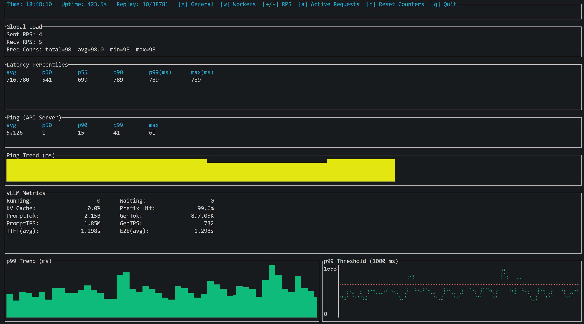

# http-hammer

`http-hammer` is a Rust load simulator for HTTP model-serving endpoints. It reads
request inputs from Parquet, builds JSON request bodies from a config file, sends
traffic at a chosen RPS, and shows live terminal metrics for request rate,
latency, p99, ping, and vLLM counters.

The project is config-driven so chat/completions and recommender traffic can be
tested as separate runs without changing code.



## What It Does

- Loads request rows from a Parquet file.
- Maps Parquet columns into JSON request fields using `body_fields`.
- Adds static request parameters from the config `template`.
- Sends requests to the configured route with keep-alive workers.
- Polls `/metrics` and `/ping` while the run is active.
- Displays a Ratatui terminal dashboard.

## Quick Start

From this repository:

```bash
cargo run -- -c config.json -f data/your_chat_dataset.parquet -r 1
```

For the included recommender fixture:

```bash
cargo run -- -c config-hstu.json -f data/recommend_random.parquet -r 1
```

Options:

```text
-r <rps>          Set initial requests per second
-f <file>         Set input Parquet file
-c, --config      Set config JSON path, default: config.json
-h, --help        Show help
```

The TUI starts with the requested RPS. If `-r 0` is used, the injector idles
until the runtime setting is changed from the UI.

## Config Files

### Chat / OneRec

`config.json` sends requests to `/v1/chat/completions`:

```json
{
  "routes": {
    "request": "/v1/chat/completions",
    "ping": "/ping",
    "metrics": "/metrics"
  },
  "model": "OpenOneRec/OneRec-1.7B",
  "body_fields": {
    "messages": "messages"
  },
  "template": {
    "use_beam_search": true,
    "n": 128,
    "max_tokens": 5
  }
}
```

Each row must provide a UTF-8 `messages` column. If the cell contains JSON, it is
parsed into JSON before being inserted into the request body.

### Recommender / HSTU

`config-hstu.json` sends requests to `/recommend`:

```json
{
  "routes": {
    "request": "/recommend",
    "ping": "/ping",
    "metrics": "/metrics"
  },
  "model": "movielens-1m",
  "body_fields": {
    "request_id": "request_id",
    "prompt": "prompt"
  },
  "template": {
    "priority": 0
  }
}
```

The included fixture is:

```text
data/recommend_random.parquet
```

The recommender path is a different API contract from chat/completions. Run one
mode or the other by selecting the matching config file.

## Request Body Construction

For every Parquet row, `http-hammer` builds a JSON body in this order:

1. Add `"model"` from the config.
2. Add fields listed in `body_fields`.
3. Add or override fields from `template`.

Example:

```json
{
  "model": "movielens-1m",
  "request_id": "req_random_000001",
  "prompt": "...",
  "priority": 0
}
```

## Inspecting Parquet Input

Use the helper binary before a run to confirm column names and sample rows:

```bash
cargo run --bin load_data -- -f data/recommend_random.parquet -n 2
```

Show one column:

```bash
cargo run --bin load_data -- -f data/recommend_random.parquet -n 2 -c request_id
```

Show full cell values without truncation:

```bash
cargo run --bin load_data -- -f data/recommend_random.parquet -n 1 -c prompt --full
```

## Target Setup

The default configs assume a server is reachable on local port `8000`.

If the service is behind an SSH tunnel, open the tunnel in another terminal:

```bash
ssh -L 8000:10.10.12.102:8000 user@pick
```

Then verify:

```bash
curl -i http://127.0.0.1:8000/ping
```

## Metrics Notes

- `PromptTok` and `PromptTPS` come from `vllm:prompt_tokens_total`.
- `GenTok` and `GenTPS` come from `vllm:generation_tokens_total`.
- On recommender routes like `/recommend`, generation token metrics may stay at
  zero if the backend is ranking/scoring rather than generating text.
- `p99_threshold_ms` controls the p99 threshold display when present under
  `ui` in the config.

## Logs

Logs are written under:

```text
logs/
```

The log level is controlled by `log_level` in the selected config.
